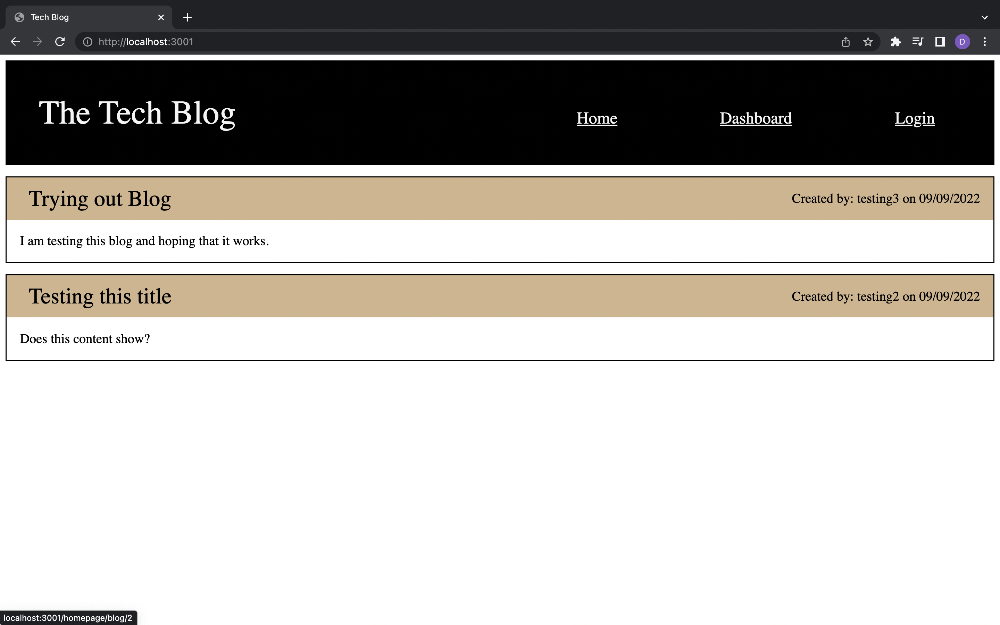

# Tech Blog

  

  ## Description 

  This application is a blog website in which you can post, comment, update, and delete posts. You will have to create an account to be able to post and see comments. This repo uses the MVC framework.

  ## Table of Contents

  - [Installation](#installation)
  - [Usage](#usage)
  - [Walkthrough](#walkthrough)
  - [Screenshot](#screenshot)
  - [License](#license)
  - [Questions](#questions)

  ## Installation

  - download all files from the repo
  - install node.js and express.js
  - install all npm packages given from package.json by typing in the terminal `npm i` 
  - type mysql `-u root -p` and enter your password for mysql in the terminal to create the db needed
  - type `exit` to exit from mysql
  - if you want to use the seeds given type `node seeds/`
  - if using locally type `npm start` to run the application

  ## Usage

  Users will be able to see posts in the homepage without logging in. To be able to see comments, add posts, edit/delete posts/comments you have to log in or sign up.

  ## Walkthrough

  

  [Link for walkthrough](https://drive.google.com/file/d/1_ZRDWhblVBC9iuR-DMGvPx3H-fUd2DiO/view)

  ## Screenshot

  

  ## License

  The license that is used for this project is: MIT License

  For more information please go to: https://choosealicense.com/licenses/mit/

  ## Questions

  GitHub Username: dcontrer83

  Link to GitHub profile: [dcontrer83 GitHub Profile](https://github.com/dcontrer83)

  Email Address: dcontrer83@yahoo.com

